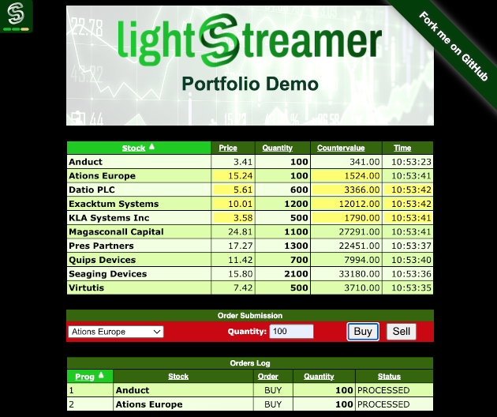
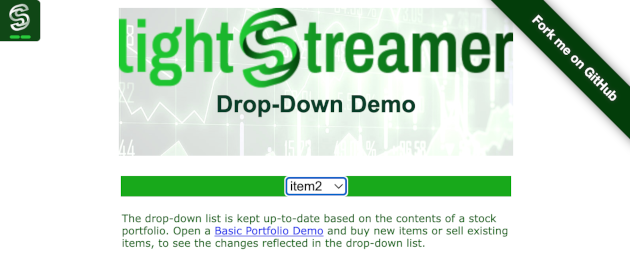

# Lightstreamer - Portfolio Demos - HTML Clients
The *Portfolio Demo* simulate a portfolio management: it shows a list of stocks included in a portfolio and provide a simple order entry form. Changes to portfolio contents, due to new orders, are displayed on the page in real time. In addition to that, the *Full Version of the Portfolio Demo* shows for each stock in the portfolio also the current price, updated in real time from a market data feed.

This project includes three different web client front-end examples for the [Lightstreamer - Portfolio Demo - Java Adapter](https://github.com/Weswit/Lightstreamer-example-Portfolio-adapter-java):

* [Basic Portfolio Demo](https://github.com/Weswit/Lightstreamer-example-Portfolio-client-javascript#basic-portfolio-demo---html-client)
* [Portfolio Demo](https://github.com/Weswit/Lightstreamer-example-Portfolio-client-javascript#portfolio-demo---html-client)
* [Dynamic Drop-Down Demo](https://github.com/Weswit/Lightstreamer-example-Portfolio-client-javascript#dynamic-drop-down-demo---html-client)

## Basic Portfolio Demo - HTML Client

<!-- START DESCRIPTION lightstreamer-example-portfolio-client-javascript-basic-portfolio-demo---html-client -->

### Live Demo

###[ View live demo](http://demos.lightstreamer.com/PortfolioDemo_Basic)

### Details

In the Basic Portfolio Demo, a virtual stock portfolio, shared among all the connected users, is displayed.

By using the "Submit Order" panel, you can buy or sell a stock (identified by an item number), filling in the Quantity field and pressing the proper button. Click on the column headers to sort the grid on different columns.
The portfolio grid is updated in push mode, for both the columns and the rows (this is the so called "metapush" feature). This portfolio is shared among all the connected users, so you can connect to this demo from different machines (or try at least different browsers on the same machine), then submit orders from one browser and see the updates displayed on another browser.
The front-end code can be considered a reference example of item subscriptions in COMMAND mode.

The demo includes the following client-side functionalities:
* A [Subscription](http://www.lightstreamer.com/docs/client_javascript_uni_api/Subscription.html) containing 1 item, subscribed to in <b>COMMAND</b> mode feeding a [DynaGrid](http://www.lightstreamer.com/docs/client_javascript_uni_api/DynaGrid.html). Each row of the grid is identified by a unique key. For didactic purpose, this example displays the command and key fields, which are usually hidden.
* The order submission is done by sending a message directly to Lightstreamer Server using the [LightstreamerClient.sendMessage](http://www.lightstreamer.com/docs/client_javascript_uni_api/LightstreamerClient.html#sendMessage) utility.

<!-- END DESCRIPTION lightstreamer-example-portfolio-client-javascript-basic-portfolio-demo---html-client -->

## Portfolio Demo - HTML Client
<!-- START DESCRIPTION lightstreamer-example-portfolio-client-javascript-portfolio-demo---html-client -->

### Live Demo

###[ View live demo](http://demos.lightstreamer.com/PortfolioDemo)

### Details

This demo application extends the [Basic Portfolio Demo](https://github.com/Weswit/Lightstreamer-example-Portfolio-client-javascript#basic-portfolio-demo---html-client) by combining live stock prices as in the [Stock-List Demos](https://github.com/Weswit/Lightstreamer-example-StockList-client-javascript) with the portfolio contents.
The columns show: stock name, last price, quantity (number of stocks in the portfolio), countervalue (=price*quantity), time of last price.

The portfolio content is the same as the [Basic Portfolio Demo](https://github.com/Weswit/Lightstreamer-example-Portfolio-client-javascript#basic-portfolio-demo---html-client) (i.e. it subscribes to the same item from the same Data Adapter) and it is shared among all the connected users. Again, you can connect to this demo from different machines and see your operations propagated everywhere.
The front-end code can be considered a reference example of item subscriptions in COMMAND mode with "two-level push".

Compared to the [Basic Portfolio Demo](https://github.com/Weswit/Lightstreamer-example-Portfolio-client-javascript#basic-portfolio-demo---html-client) a panel has been added to display information about the submission of orders. It displays your orders only and not those submitted by other connected users. The columns show: progressive number of order, stock name, type of order (buy or sell), quantity, and status of order (SUBMITTING, PROCESSED, ABORT, DENY, DISCARDED, ERROR).

The demo includes the following client-side functionalities:
* A [Subscription](http://www.lightstreamer.com/docs/client_javascript_uni_api/Subscription.html) containing 1 item, subscribed to in <b>COMMAND</b> mode feeding a [DynaGrid](http://www.lightstreamer.com/docs/client_javascript_uni_api/DynaGrid.html). Each added row automatically provokes an underlying subscription to a sub-item in <b>MERGE</b> mode, to get the real-time price for that specific stock from another feed (the same as the [Stock-List Demos](https://github.com/Weswit/Lightstreamer-example-Stocklist-client-javascript)). When a row is deleted, the underlying sub-item is automatically unsubscribed from.
* The order submission is done by sending a message directly to Lightstreamer Server using the [LightstreamerClient.sendMessage](http://www.lightstreamer.com/docs/client_javascript_uni_api/LightstreamerClient.html#sendMessage) utility.
* A [DynaGrid](http://www.lightstreamer.com/docs/client_javascript_uni_api/DynaGrid.html) is fed dynamically with one row for each sendMessage invocation and updated via an appropriate [ClientMessageListener](http://www.lightstreamer.com/docs/client_javascript_uni_api/ClientMessageListener.html).

<!-- END DESCRIPTION lightstreamer-example-portfolio-client-javascript-portfolio-demo---html-client -->

## Dynamic Drop-Down Demo - HTML Client 
<!-- START DESCRIPTION lightstreamer-example-portfolio-client-javascript-dynamic-drop-down-demo---html-client -->

### Live Demo

###[ View live demo](http://demos.lightstreamer.com/DropDownDemo)

### Details

This demo application shows a changeable list of items within a normal HTML drop-down menu. The contents of the list change in real time, based on the commands pushed by the Server. 
The feed that controls the list contents is the same as in the [Portfolio Demos](https://github.com/Weswit/Lightstreamer-example-Portfolio-client-javascript#basic-portfolio-demo---html-client) (i.e. it subscribes to the same item from the same Data Adapter) and it is shared among all the connected users. So, you can see the drop-down menu kept in sync across all the browsers connected to this page.

The front-end code can be considered a reference example of visualization of data, coming from an item subscription, that does not leverage the Lightstreamer widgets, but uses custom HTML code or third-party widgets.

The demo includes the following client-side functionalities:
* A [Subscription](http://www.lightstreamer.com/docs/client_javascript_uni_api/Subscription.html) containing 1 item, subscribed to in <b>COMMAND</b> mode. Each time the Server sends an "add" or "delete" command, the JavaScript code manipulates the drop-down menu to update its contents.

<!-- END DESCRIPTION lightstreamer-example-portfolio-client-javascript-dynamic-drop-down-demo---html-client -->

## Install
If you want to install one of these demo versions, pointing to your local Lightstreamer Server, follow the steps below.

* As prerequisite, the [Lightstreamer - Portfolio Demo - Java Adapter](https://github.com/Weswit/Lightstreamer-example-Portfolio-adapter-java) has to be deployed on your local Lightstreamer Server instance. Moreover, the full version of the *Portfolio Demo*,
needs both the *PORTFOLIO_ADAPTER*, from the *Portfolio Demo*, and the *QUOTE_ADAPTER*, from the *Stock-List Demo* (see [Lightstreamer - Stock-List Demo - Java Adapter](https://github.com/Weswit/Lightstreamer-example-StockList-adapter-java)). Please check out the [Lightstreamer - Portfolio Demo - Java Adapter](https://github.com/Weswit/Lightstreamer-example-Portfolio-adapter-java) project and follow the [installation instructions for the full version of the *Portfolio Demo*](https://github.com/Weswit/Lightstreamer-example-Portfolio-adapter-java#portfolio-demo).
* Download this project.
* Get the `lightstreamer.js` file from the [latest Lightstreamer distribution](http://www.lightstreamer.com/download) and put it in the `src/[demo_name]/js` folder of the demo. Alternatively you can build a `lightstreamer.js` file from the [online generator](http://www.lightstreamer.com/distros/Lightstreamer_Allegro-Presto-Vivace_5_0_Colosseo_20120803/Lightstreamer/DOCS-SDKs/sdk_client_javascript/tools/generator.html). In that case be sure to include the LightstreamerClient, Subscription, DynaGrid and StatusWidget modules and to use the "Use AMD" version.
* Get the `require.js` file form the [requirejs.org](http://requirejs.org/docs/download.html) and put it in the `src/[demo_name]/js` folder of the demo.
* Deploy this demo on the Lightstreamer Server (used as Web server) or in any external Web Server. If you choose the former, please note that in the `<LS_HOME>/pages/demos/` folder there may be already a `PortfolioDemo` or a `PortfolioDemo_Basic` or a `DropDownDemo` folders. If this is not your case, please follow these steps:
    * create the folder `<LS_HOME>/pages/demos/PortfolioDemo_Basic`, and copy here the contents of the `src/PortfolioDemo_Basic` folder;
    * create the folder `<LS_HOME>/pages/demos/PortfolioDemo`, and copy here the contents of the `src/PortfolioDemo` folder;
    * create the folder `<LS_HOME>/pages/demos/DropDownDemo`, and copy here the contents of the `src/DropDownDemo` folder.
    * The client demo configuration assumes that Lightstreamer Server, Lightstreamer Adapters and these clients are launched on the same machine. If you need to target a different Lightstreamer server, please search in `src/[demo_name]/js/lsClient.js` this line:  
`var lsClient = new LightstreamerClient(protocolToUse+"//localhost:"+portToUse,"PORTFOLIODEMO");` 
and change it accordingly.
* Open your browser and point it to:  
    * [http://localhost:8080/demos/PortfolioDemo_Basic/](http://localhost:8080/demos/PortfolioDemo_Basic/),
    * [http://localhost:8080/demos/PortfolioDemo/](http://localhost:8080/demos/PortfolioDemo/) and
    * [http://localhost:8080/demos/DropDownDemo/](http://localhost:8080/demos/DropDownDemo/).

## See Also

### Lightstreamer Adapters Needed by These Clients
<!-- START RELATED_ENTRIES -->

* [Lightstreamer - Portfolio Demo - Java Adapter](https://github.com/Weswit/Lightstreamer-example-Portfolio-adapter-java)
* [Lightstreamer - Stock-List Demo - Java Adapter](https://github.com/Weswit/Lightstreamer-example-Stocklist-adapter-java)

<!-- END RELATED_ENTRIES -->

### Related Projects

* [Lightstreamer - Portfolio Demo - Flex Client](https://github.com/Weswit/Lightstreamer-example-Portfolio-client-flex)
* [Lightstreamer - Stock-List Demos - HTML Clients](https://github.com/Weswit/Lightstreamer-example-Stocklist-client-javascript)

## Lightstreamer Compatibility Notes

- Compatible with Lightstreamer JavaScript Client library version 6.0 or newer.

