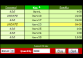
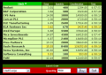
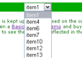

# Lightstreamer - Portfolio Demos - HTML Clients #

This project includes three different demo based on [Lightstreamer - Portfolio Demo - Java Adapter](https://github.com/Weswit/Lightstreamer-example-Portfolio-adapter-java):

* Basic Portfolio Demo
* Portfolio Demo
* Dynamic Drop-Down Demo

## Basic Portfolio Demo - HTML Client ##
<!-- START DESCRIPTION lightstreamer-example-portfolio-client-javascript-basic-portfolio-demo---html-client -->

<table>
  <tr>
    <td style="text-align: left">
      &nbsp;<a href="http://demos.lightstreamer.com/PortfolioDemo_Basic" target="_blank"></a>&nbsp;
      
    </td>
    <td>
      &nbsp;An online demonstration is hosted on our servers at:<br>
      &nbsp;<a href="http://demos.lightstreamer.com/PortfolioDemo_Basic" target="_blank">http://demos.lightstreamer.com/PortfolioDemo_Basic</a>
    </td>
  </tr>
</table>

In the Basic Portfolio Demo, a virtual stock portfolio, shared among all the connected users, is displayed.<br>
By using the "Submit Order" panel, you can buy or sell a stock (identified by an item number), filling in the Quantity field and pressing the proper button. Click on the column headers to sort the grid on different columns.
The portfolio grid is updated in push mode, for both the columns and the rows (this is the so called "metapush" feature). This portfolio is shared among all the connected users, so you can connect to this demo from different machines (or try at least different browsers on the same machine), then submit orders from one browser and see the updates displayed on another browser.
The front-end code can be considered a reference example of item subscriptions in COMMAND mode.

The demo includes the following client-side technologies:
* A [Subscription](http://www.lightstreamer.com/docs/client_javascript_uni_api/Subscription.html) containing 1 item, subscribed to in <b>COMMAND</b> mode feeding a [DynaGrid](http://www.lightstreamer.com/docs/client_javascript_uni_api/DynaGrid.html). Each row of the grid is identified by a unique key. For didactic purpose, this example displays the command and key fields, which are usually hidden.
* The order submission is done by sending a message directly to Lightstreamer Server using the [LightstreamerClient.sendMessage](http://www.lightstreamer.com/docs/client_javascript_uni_api/LightstreamerClient.html#sendMessage) utility.

<!-- END DESCRIPTION lightstreamer-example-portfolio-client-javascript-basic-portfolio-demo---html-client -->

## Portfolio Demo - HTML Client ##
<!-- START DESCRIPTION lightstreamer-example-portfolio-client-javascript-portfolio-demo---html-client -->

<table>
  <tr>
    <td style="text-align: left">
      &nbsp;<a href="http://demos.lightstreamer.com/PortfolioDemo" target="_blank"></a>&nbsp;
      
    </td>
    <td>
      &nbsp;An online demonstration is hosted on our servers at:<br>
      &nbsp;<a href="http://demos.lightstreamer.com/PortfolioDemo" target="_blank">http://demos.lightstreamer.com/PortfolioDemo</a>
    </td>
  </tr>
</table>

This demo application extends the [Basic Portfolio Demo](http://www.lightstreamer.com/demos#PortfolioDemo_Basic) by combining live stock prices as in the [Stock-List Demos](https://github.com/Weswit/Lightstreamer-example-StockList-client-javascript) with the portfolio contents.
The columns show: stock name, last price, quantity (number of stocks in the portfolio), countervalue (=price*quantity), time of last price.

The portfolio content is the same as the [Basic Portfolio Demo](http://www.lightstreamer.com/demos#PortfolioDemo_Basic) (i.e. it subscribes to the same item from the same Data Adapter) and it is shared among all the connected users. Again, you can connect to this demo from different machines and see your operations propagated everywhere.
The front-end code can be considered a reference example of item subscriptions in COMMAND mode with "two-level push".

Compared to the [Basic Portfolio Demo](http://www.lightstreamer.com/demos#PortfolioDemo_Basic) a panel has been added to display information about the submission of orders. It displays your orders only and not those submitted by other connected users. The columns show: progressive number of order, stock name, type of order (buy or sell), quantity, and status of order (SUBMITTING, PROCESSED, ABORT, DENY, DISCARDED, ERROR).

The demo includes the following client-side technologies:
* A [Subscription](http://www.lightstreamer.com/docs/client_javascript_uni_api/Subscription.html) containing 1 item, subscribed to in <b>COMMAND</b> mode feeding a [DynaGrid](http://www.lightstreamer.com/docs/client_javascript_uni_api/DynaGrid.html). Each added row automatically provokes an underlying subscription to a sub-item in <b>MERGE</b> mode, to get the real-time price for that specific stock from another feed (the same as the Stock-List Demos). When a row is deleted, the underlying sub-item is automatically unsubscribed from.
* The order submission is done by sending a message directly to Lightstreamer Server using the [LightstreamerClient.sendMessage](http://www.lightstreamer.com/docs/client_javascript_uni_api/LightstreamerClient.html#sendMessage) utility.
* A [DynaGrid](http://www.lightstreamer.com/docs/client_javascript_uni_api/DynaGrid.html) is fed dynamically with one row for each sendMessage invocation and updated via an appropriate [ClientMessageListener](http://www.lightstreamer.com/docs/client_javascript_uni_api/ClientMessageListener.html).

<!-- END DESCRIPTION lightstreamer-example-portfolio-client-javascript-portfolio-demo---html-client -->

## Dynamic Drop-Down Demo - HTML Client ##
<!-- START DESCRIPTION lightstreamer-example-portfolio-client-javascript-dynamic-drop-down-demo---html-client -->

<table>
  <tr>
    <td style="text-align: left">
      &nbsp;<a href="http://demos.lightstreamer.com/DropDownDemo" target="_blank"></a>&nbsp;
      
    </td>
    <td>
      &nbsp;An online demonstration is hosted on our servers at:<br>
      &nbsp;<a href="http://demos.lightstreamer.com/DropDownDemo" target="_blank">http://demos.lightstreamer.com/DropDownDemo</a>
    </td>
  </tr>
</table>

This demo application shows a changeable list of items within a normal HTML drop-down menu. The contents of the list change in real time, based on the commands pushed by the Server.<br>
The feed that controls the list contents is the same as in the Portfolio Demos (i.e. it subscribes to the same item from the same Data Adapter) and it is shared among all the connected users. So, you can see the drop-down menu kept in sync across all the browsers connected to this page.

The front-end code can be considered a reference example of visualization of data, coming from an item subscription, that does not leverage the Lightstreamer widgets, but uses custom HTML code or third-party widgets.

The demo includes the following client-side technologies:
* A [Subscription](http://www.lightstreamer.com/docs/client_javascript_uni_api/Subscription.html) containing 1 item, subscribed to in <b>COMMAND</b> mode. Each time the Server sends an "add" or "delete" command, the JavaScript code manipulates the drop-down menu to update its contents.

<!-- END DESCRIPTION lightstreamer-example-portfolio-client-javascript-dynamic-drop-down-demo---html-client -->

# Deploy #

Before you can run the demos of this project some dependencies need to be solved:

-  Get the lightstreamer.js file from the [latest Lightstreamer distribution](http://www.lightstreamer.com/download) 
   and put it in the src/[demo_name]/js folder of the demo. Alternatively you can build a lightstreamer.js file from the 
   [online generator](http://www.lightstreamer.com/distros/Lightstreamer_Allegro-Presto-Vivace_5_0_Colosseo_20120803/Lightstreamer/DOCS-SDKs/sdk_client_javascript/tools/generator.html).
   In that case be sure to include the LightstreamerClient, Subscription, DynaGrid and StatusWidget modules and to use the "Use AMD" version.
-  Get the require.js file form the [requirejs.org](http://requirejs.org/docs/download.html) and put it in the src/[demo_name]/js folder of the demo.

You can deploy these demos in order to use the Lightstreamer server as Web server or in any external Web Server you are running. 
If you choose the former case please note that in the <LS_HOME>/pages/demos/ folder there is a copy of the src/PortfolioDemo, src/PortfolioDemo_Basic, and src/DropDownDemo directories of this project (If it is not your case, please create the folders <LS_HOME>/pages/demos/PortfolioDemo, <LS_HOME>/pages/demos/PortfolioDemo_Basic, and <LS_HOME>/pages/demos/DropDownDemo then copy here the contents of the src/PortfolioDemo, src/PortfolioDemo_Basic, and src/DropDownDemo folders of this project). The client demos configuration assume that Lightstreamer Server, Lightstreamer Adapters and this client are launched on the same machine.
If you need to targeting a different Lightstreamer server please search this line in lsClient.js:
```js
var lsClient = new LightstreamerClient(protocolToUse+"//localhost:8080","PORTFOLIODEMO");
```
and change it accordingly.<br>
Anyway the [PORTFOLIO_ADAPTER](https://github.com/Weswit/Lightstreamer-example-Portfolio-adapter-java), [QUOTE_ADAPTER](https://github.com/Weswit/Lightstreamer-example-Stocklist-adapter-java) (only for PortfolioDemo), and [PortfolioMetadataAdapter](https://github.com/Weswit/Lightstreamer-example-Portfolio-adapter-java) have to be deployed in your local Lightstreamer server instance. The factory configuration of Lightstreamer server already provides this adapters deployed.<br>
The demos are now ready to be launched.


# See Also #

## Lightstreamer Adapters needed by these demo clients ##
<!-- START RELATED_ENTRIES -->

* [Lightstreamer - Portfolio Demo - Java Adapter](https://github.com/Weswit/Lightstreamer-example-Portfolio-adapter-java)
* [Lightstreamer - Stock-List Demo - Java Adapter](https://github.com/Weswit/Lightstreamer-example-Stocklist-adapter-java)

<!-- END RELATED_ENTRIES -->

## Similar demo clients that may interest you ##

* [Lightstreamer - Portfolio Demo - Flex Client](https://github.com/Weswit/Lightstreamer-example-Portfolio-client-flex)
* [Lightstreamer - Stock-List Demos - HTML Clients](https://github.com/Weswit/Lightstreamer-example-Stocklist-client-javascript)

Lightstreamer Compatibility Notes
---------------------------------

- Compatible with Lightstreamer JavaScript Client library version 6.0 or newer.
